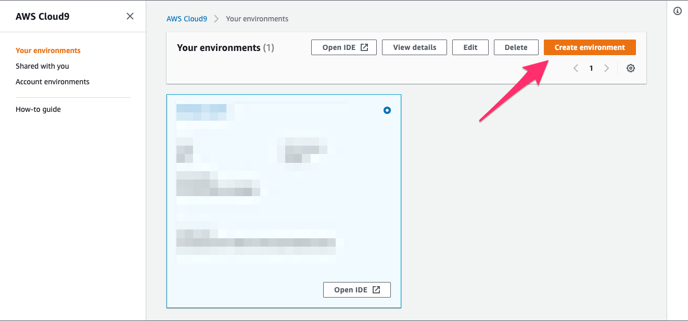
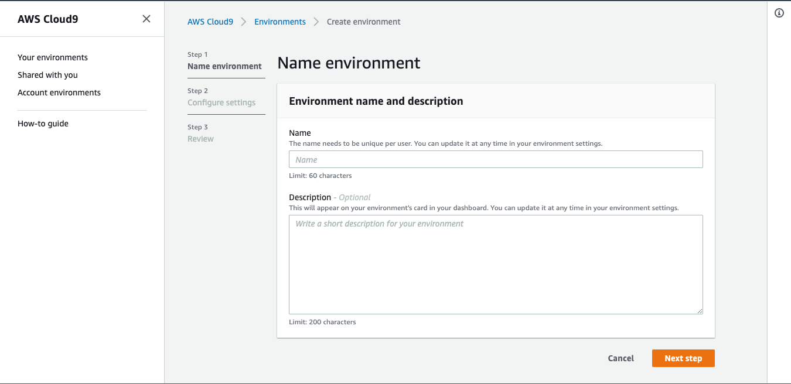
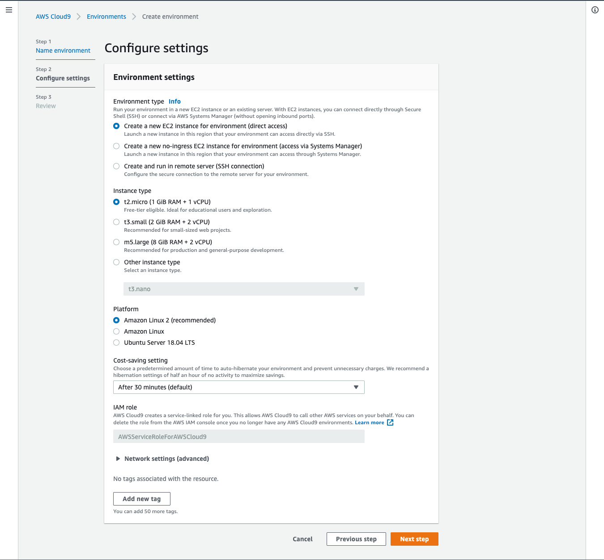
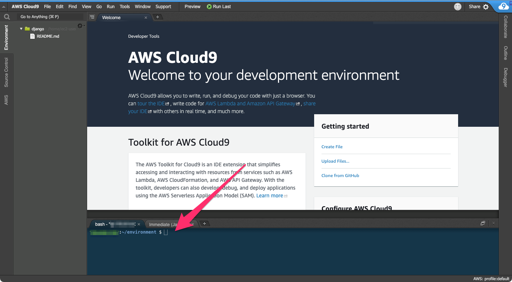

# Cloud9でPython開発環境を作る

## 初めに

この記事は、LinuxのPython開発環境を簡単に用意する手段としてCloud9を利用する手順です。

## Cloud9インスタンスを立ち上げる

1. [AWSマネジメントコンソール](https://aws.amazon.com/jp/console/) にログインします

1. 使用するリージョンを選択します

1. 検索窓に`cloud9`と入力し、AWS Cloud9コンソールを開きます

1. [Create environment]を選択します



1. 環境の名前と説明の入力を求められるので、入力します。入力したら Next stepをクリックします。



1. 環境設定を求められるので、設定します。(この記事では全てデフォルトで進めます。)  
選択し終わったら Next stepをクリックします。

    - Environment Type : Create a new insntance for environment (direct access)
    - Instance type : t2.micro
    - Platform : Amazon Linux2(recommended)
    - Cost-saving setting : After 30 minutes(default)



1. 設定のレビューが表示されるので、確認し、問題がなければ Create environmentをクリックします。  
クリックするとEC2にCloud9のインスタンスが作成されます。ブラウザはCloud9に遷移し、環境が起動すると以下のようなウェルカム画面が表示されます。


## Cloud9環境を確認する

Cloud9が起動したら、環境の確認を行います。Cloud9はインスタンスをデプロイするタイミングにより使用されるイメージが異なるので、デプロイしたら確認したほうが良いでしょう。

Cloud9のデフォルトでは、下部にターミナルウィンドウが表示されています。これはCloud9を実行しているEC2インスタンスに接続されています。この記事では、Cloud9のPlatformにAmazon Linux2を選択したので、ターミナルウィンドウからLinuxコマンドを入力して、Cloud9を実行しているインスタンスを操作することができます。

**この記事では、以降の操作はターミナルウィンドウから行います**



まずは、OSのバージョンなどを確認します。この記事の作成時点では以下のようになっていました。

```
$ cat /proc/version 
Linux version 4.14.225-168.357.amzn2.x86_64 (mockbuild@ip-10-0-1-132) (gcc version 7.3.1 20180712 (Red Hat 7.3.1-12) (GCC)) #1 SMP Mon Mar 15 18:00:02 UTC 2021

$ uname -a
Linux ip-172-31-1-107.ap-northeast-1.compute.internal 4.14.225-168.357.amzn2.x86_64 #1 SMP Mon Mar 15 18:00:02 UTC 2021 x86_64 x86_64 x86_64 GNU/Linux

$ cat /etc/system-release
Amazon Linux release 2 (Karoo)

$ cat /etc/os-release
NAME="Amazon Linux"
VERSION="2"
ID="amzn"
ID_LIKE="centos rhel fedora"
VERSION_ID="2"
PRETTY_NAME="Amazon Linux 2"
ANSI_COLOR="0;33"
CPE_NAME="cpe:2.3:o:amazon:amazon_linux:2"
HOME_URL="https://amazonlinux.com/"
```
## Pythonとpipのバージョンを確認する

Pythonとpipバージョンも確認しておきます。同じく、記事作成時点では以下のようになっていました。

```
$ python --version
Python 3.7.9
$ sudo python --version
Python 2.7.18
```

`sudo python`ではPython 2.7にパスが通っているので注意が必要です。(イメージによって異なる可能性があります。)

```
$ python -m pip --version
pip 9.0.3 from /usr/lib/python3.7/site-packages (python 3.7)
```
## pipを更新する

仮想環境を起動したら、pipを最新バージョンに更新します。  
記事作成時点では、pipのバージョンは20.1.1でした。

以下のコマンドを実行して、更新します。  

```
$ pip3 install --upgrade pip --user
Collecting pip
  Downloading https://files.pythonhosted.org/packages/fe/ef/60d7ba03b5c442309ef42e7d69959f73aacccd0d86008362a681c4698e83/pip-21.0.1-py3-none-any.whl (1.5MB)
    100% |████████████████████████████████| 1.5MB 812kB/s 
Installing collected packages: pip
Successfully installed pip-21.0.1

$ python -m pip --version
pip 21.0.1 from /home/ec2-user/.local/lib/python3.7/site-packages/pip (python 3.7)
```

実行した結果21.0.1になりました。

## Virtualenvを作成し起動する

Python 3.3以降、標準機能であるvenvで仮想環境を作成することで、pipで導入するパッケージをプロジェクト毎に独立させることができます。

Cloud9を利用する場合プロジェクト毎にインスタンスを分ければ仮想環境は必要ないように思えます。
しかしPythonがプリインストールされているLinux環境の場合、標準でないライブラリがインストールされている場合があります。

この記事作成時点でのCloud9では以下のようになっていました。これから開発するソフトウェアが既にインストールされているライブラリの影響を受けないようにする為にvenvを使用します。

```
$ python -m pip freeze
astroid==2.3.0
backcall==0.2.0
botocore==1.20.37
decorator==4.4.2
Django==2.0.2
git-remote-codecommit==1.15.1
ikp3db==1.4.1
importlib-metadata==3.7.3
ipython==7.21.0
ipython-genutils==0.2.0
isort==4.3.21
jedi==0.18.0
jmespath==0.10.0
lazy-object-proxy==1.6.0
mccabe==0.6.1
parso==0.8.1
pbr==5.5.1
pexpect==4.8.0
pickleshare==0.7.5
prompt-toolkit==3.0.18
ptyprocess==0.7.0
Pygments==2.8.1
pylint==2.4.4
pylint-django==2.3.0
pylint-flask==0.6
pylint-plugin-utils==0.6
python-dateutil==2.8.1
pytz==2021.1
six==1.15.0
stevedore==3.3.0
traitlets==5.0.5
typed-ast==1.4.2
typing-extensions==3.7.4.3
urllib3==1.26.4
virtualenv==16.2.0
virtualenv-clone==0.5.4
virtualenvwrapper==4.8.4
wcwidth==0.2.5
wrapt==1.12.1
zipp==3.4.1
```

`~/environment`ディレクトリで、仮想環境を作成します。今回は myenv という名前にします。

```
$ cd ~/environment
$ python -mvenv myenv
```

仮想環境を作成すると、カレントディレクトリに仮想環境名(今回はmyenv)のディレクトリが作成されます。)

```
$ ls -l
total 4
drwxrwxr-x 5 ec2-user ec2-user  74 Mar 29 13:32 myenv
-rw-r--r-- 1 ec2-user ec2-user 569 Mar 18 10:35 README.md
```


仮想環境を作成したら、以下のコマンドで仮想環境を起動します。

```
$ source myenv/bin/activete
```

venvを作成しactivateした直後にpip freezeすると、ライブラリが何もインストールされていないことがわかります。

```
$ python -m pip freeze
$    # <- 何も表示されない
```

なお、仮想環境から抜ける場合は以下のコマンドを実行します。

```
$ deactivate
```

参考: [venv \-\-\- 仮想環境の作成 — Python 3\.9\.2 ドキュメント](https://docs.python.org/ja/3/library/venv.html#module-venv)


